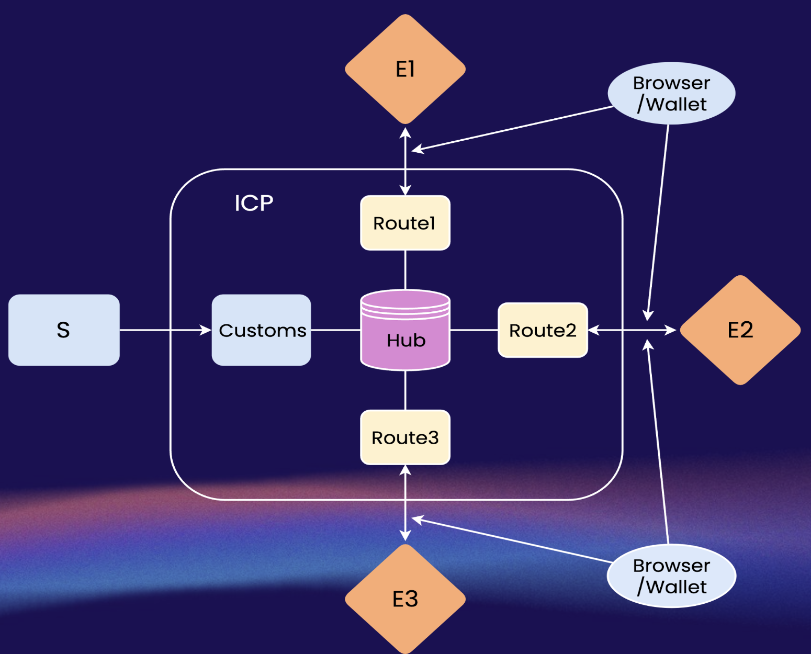
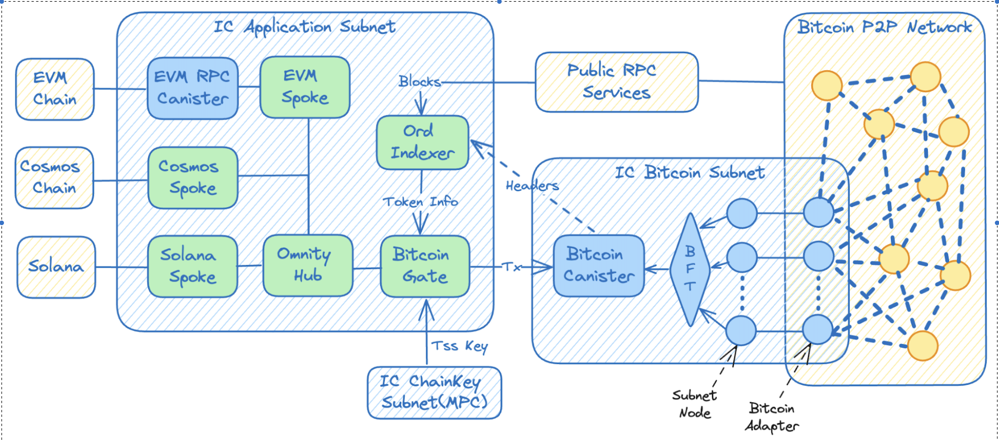

# Omnity Interoperability

Omnity is an omni-chain interoperability protocol built by Octopus Network on the Internet Computer (IC) specially designed to fit the modular blockchain landscape. It is implemented by a set of smart contracts deployed on IC.

## High-level Design

* E : Settlement chains. Currently we have the Bitcoin chain and ICP as the settlement chains.
* S : Execution chains. Currently we have the ICP, Bevm, Bitlayer, B² Network, X Layer, and Merlin as the execution chains.
* Ticket: a transaction message.
* Hub: A center point for chain and token registration, both settlement chains and execution chains are listed in the hub. AS a relayer gathering the tickets, Hub is based on the publisher/subscriber pattern.
* Customs: The Customs is where the assets are listed. The Customs generate transfering ticket.
* Route: Each route represents a execution chain. The Routes generate redeeming ticket.
* Port: Executes the directives from the Hub, mints tokens for cross-chain assets from settlement chains, processes token transport and token redeem requests from token holders.

### Logical Architecture For Bitcoin Assets

* Gate is Customs in this image.
* Spoke is Route in this image.
* Bitcoin Token Canister:  A solution for fetching the Runes information detail. We have finished transplanting the ord indexer to ICP. The Bitcoin header API will help the ord canister remove its trust assumption on RPC services.
* Bitcoin Canister: A native Bitcoin integration on ICP, the gateway where the bitcoin address can fetch its status like balance and make transactions through the provided APIs.

## Current Support Chains

* Bitcoin (https://bitcoin.org/en/)
* ICP (https://internetcomputer.org/)
* Bevm (https://www.bevm.io/)
* Bitlayer (https://www.bitlayer.org/)
* B² Network (https://www.bsquared.network/)
* X Layer (https://www.okx.com/xlayer)
* Merlin (https://merlinchain.io/)

## Social Media

* [OpenChat](https://oc.app/community/o5uz6-dqaaa-aaaar-bhnia-cai/channel/55564096078728941684293384519740574712/)
* [X](https://twitter.com/OmnityNetwork)
* [Medium](https://medium.com/omnity)
* [Dapp](https://bridge.omnity.network/)
* [Red Envelope](https://oc.app/community/csmnf-nyaaa-aaaar-a2uda-cai/channel/257625026752796078802282812381756979432/?ref=iets5-biaaa-aaaaf-blpfq-cai)
* [Technical support](https://oc.app/community/o5uz6-dqaaa-aaaar-bhnia-cai/channel/209373796018851818071085429101874032721/)

## Audits

This repository has been audited by [Blocksec](https://blocksec.com/). See the [report](./auditing-reports/blocksec_omnity_v1.0_signed.pdf).
