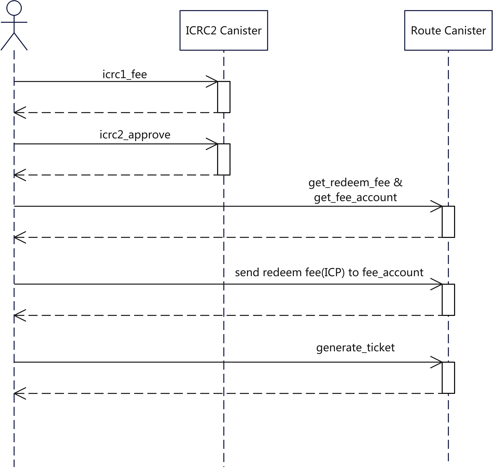

# Omnity ICP Route

## Running the project locally

If you want to test your project locally, you can use the following commands:

```bash
# Starts the replica, running in the background
dfx start --background

# Deploys your canisters to the replica and generates your candid interface
dfx deploy
```

## ICP Route Redeem Process 


### Step 1: Approve Icrc Token
The ICP's Token protocol (ICRC) can set transfer fees, and the fees token is itself. The token canisters deployed by the Router have set the transfer fee. And for the standard approval process of the ICRC2 protocol, the transfer fee is charged during the icrc2_approve call. So:  
1. Query the transfer fee from the token canister using the icrc1_fee interface.
2. Call icrc2_approve to allow the Router canister to spend the user's tokens.

### Step 2: Transfer redeem fee(ICP)
For ICP-side initiated cross-chain, we will charge ICP Token as a handling fee. The fee is paid by having the address that initiated the cross-chain transfer the icp to a sub-account of route canister.

1. Invoke the two interfaces get_redeem_fee and get_fee_account to obtain the amount of fee and the fee collection address corresponding to the cross-chain account respectively.
2. Send icp to fee's collection address.

### Step 3: Generate Ticket

Call the generate_ticket interface of route canister to initiate the cross-chain.